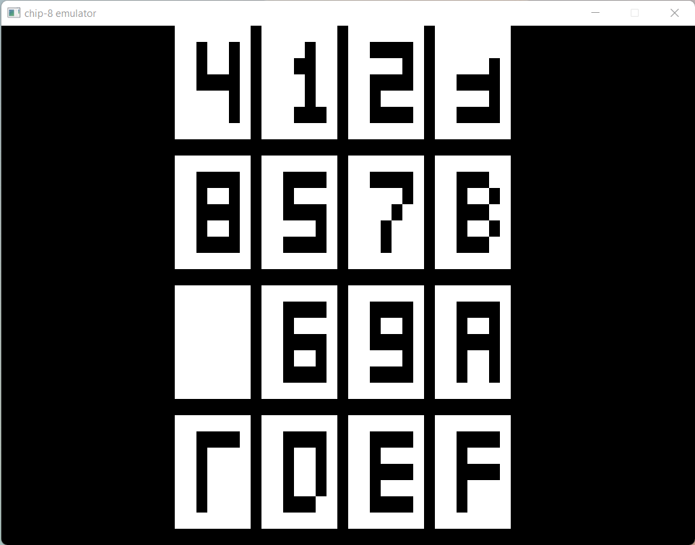

# CHIP-8 + Golang

This project contains a [CHIP-8](https://en.wikipedia.org/wiki/CHIP-8) emulator written in Go. The CHIP-8 actually never was a real system, but more like a virtual machine. Games written in the CHIP-8 language could easily run on systems that had a CHIP-8 interpreter. So in reality this project is more like a CHIP-8 interpreter.



## Resources
- [How to write an emulator (CHIP-8 interpreter)](https://multigesture.net/articles/how-to-write-an-emulator-chip-8-interpreter/).
- [Cowgod's Chip-8 Technical Reference v1.0](http://devernay.free.fr/hacks/chip8/C8TECH10.HTM)
- [Writing a CHIP-8 emulator (interpreter) in Go - chip8go](https://www.youtube.com/watch?v=MBWyVwyBMhk)
- [Writing an Emulator in JavaScript (Chip-8)](https://www.taniarascia.com/writing-an-emulator-in-javascript-chip8/)
- [CHIP-8 ROMs](https://github.com/kripod/chip8-roms).

## Why build another emulator?
As a CS student many of the terms that appear in my degree are closely related to those that can be seen in this project. So it can be seen as a different form of study to assimilate certain concepts.

And also because it's fun.

## Things to keep in mind
This project uses the incredible [faiface/pixel](https://github.com/faiface/pixel) so it's important that you check the compatibility of your system with this library to avoid possible errors. If you are using Windows for example, you may need to install the `GCC` toolchain.

## Installation
I really recommend to just clone this repository and run the program directly from the command line.

````bash
git clone https://github.com/daniarlert/chip-8-go.git
cd chip-8-go
go run .
````

## Usage
To select the ROM you want to try:

```bash
go run . --rom "roms/Puzzle.ch8"
```

If you want to also modify the clock speed:

````bash
go run . --form "roms/Puzzle.ch8" --ck 90
````

## Pending
- [ ] Support beeping.
- [ ] Better documentation.
- [ ] Testing.